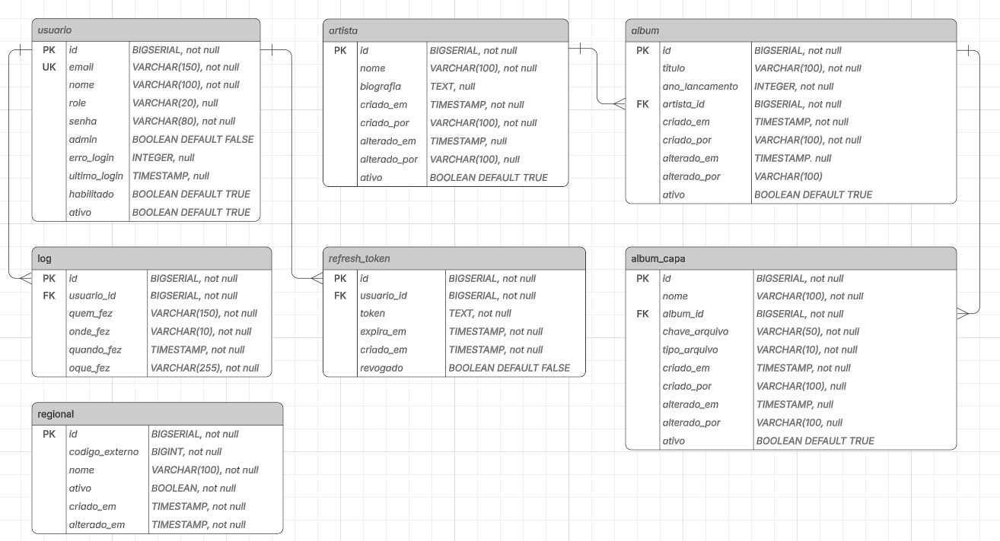

# Projeto - Sistema de gestão de artistas e álbuns
Sistema feito como solicitado no edital 001/2026 (Anexo II-C)

---

## Identificação

**Autor:** João Paulo Nery de Assunção.

**Número de Inscrição:** 

**Vaga Pleiteada:** Analista de Tecnologia da Informação - Perfil Engenheiro da Computação (Sênior) - Full Stack

**Perfil:** Analista de TI | Sistemas de Informação | Pós-graduação em Banco de Dados e Inteligência Artificial

**Edital:** Processo Seletivo Simplificado Nº 001/2026/SEPLAG (Anexo II-C - Projeto Full Stack) 

---

## Requisitos para o Projeto

### Programas e Versões Necessárias

- **Java 21** (JDK)
- **Docker Desktop** (ou Docker + Docker Compose)
- **Git**
### Portas
**Portas utilizadas pelo projeto:**
- `5432` - PostgreSQL (Banco de Dados)
- `9000` - MinIO API (Armazenamento)
- `9001` - MinIO Console (Interface Web)

> **Nota:** Verifique a disponibilidades das portas antes de iniciar o projeto.
**Windows - Powershell**
```
    netstat -ano | findstr ":5432 :9000 :9001"
```
**Linux**
```
    netstat -tuln | grep -E ':(5432|9000|9001)'
```

## Instruções de Execução

### Executar com Docker Compose
```
docker-compose up -d
```
### Verificar Containers 
```
docker-compose ps
```
### Acesso
- **PostgreSQL:** localhost:5432
    -**Database**: musicadb
    -**User**: sa
    -**Password**: a1b2c3d4E5 - *Olhar anotação em PDS.md linha 49*
- **MinIO Console** http://localhost:9001
    -**User:** admin
    -**Password:** a1b2c3D4e5 - *Olhar anotação em PDS.md linha 49*
- **MinIO API:** http://localhost:9000


---
## Documentação

### Planejamento 

- [Matriz de Rastreabilidade de Requisitos](docs/RTM.md)
- [Plano de Desenvolvimento de Software](docs/PDS.md)
- [Registro de Decisões Arquiteturais](docs/ADR.md)
- [Modelo de Dados](docs/modelo_dados.md)

---
### Banco de Dados

**Diagrama ER**


*Nota de Modelagem* - A exigência de relacionamento N:N está presente apenas no Anexo II-A (Backend). Como este projeto atende aos requisitos do Anexo II-C (Full Stack), escolheu-se a cardinalidade 1:N para preservar a consistência com a estrutura de dados proposta nos exemplos do edital.

---

## Segurança

**JWT_SECRET:** Gerado por:
```
openssl rand -base64 32
```
**.env (Contexto de Avaliação):**
- O arquivo `.env` foi intencionalmente versionado neste repositório para facilitar a execução para avaliação.